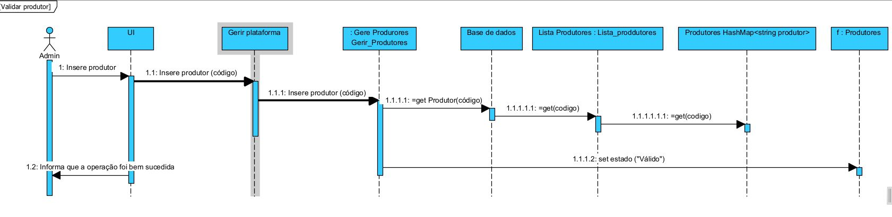

# Implementation Doc

This document presents the project design artifacts developed to support the software development of sprint 03.

## Interface mockups
THe interface mockups help to to better understand the features to be created.

### Mockup for UC1.01a

A seguinte figura apresenta o mockup para o use case "Novo Registo". O cliente acede ao sistema por um browser.

### Mockup for US1.1b 

Como utilizador tenho que fazer login para começar a comprar produtos.

A seguinte figura apresenta o mockup para o use case "Login". O cliente efectua login para efectuar compras. O cliente pode analizar o carrinho de compras antes de submeter a ordem de compra, remover produtos ou continuar o processo de compra de mais artigos.

### Mockup for US1.1c 

Como utilizador tenho que fazer login para que possa completar o meu processo de registo acedeendo ao meu perfil e inserindo os dados necessários na minha conta.

A seguinte figura demostra o processo de inserção dos dados neccessários para que possa completar o processo de registo.

## Class model

Baseado no diagrama de dominio, foi desenvolvido o diagrama de clases. O 

Based on the domain model, we need to develop a detailed class diagram. The diagram does not need to be complete, but should comprise the all the classes involved in the sprint.
The class diagram includes also the boundary and control classes for both use cases.

When the user loads money to the system, his/her account balance in that instant is calculated and stored with the money load data.
We assume that the account balance is calculated based on the last money load, from which the tickets purchased after that moment are subtracted.

## Novo Registo (UC1.01) Sequence Diagram

O seguinte diagrama de sequência não apresenta todas as possíveis interações mas sim as básicas.

## Caso de uso: Valida Produtor(CdU1.11) Sequence Diagram

O seguinte diagrama de sequência interações básicas do caso de uso Valida Produtor.

[Back Home](Home)
