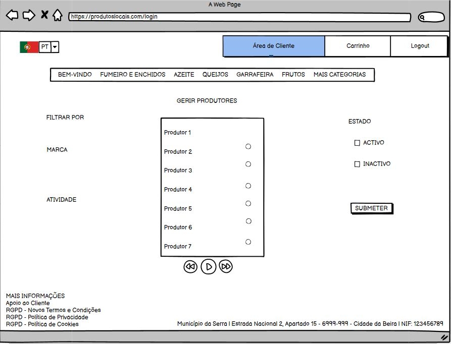
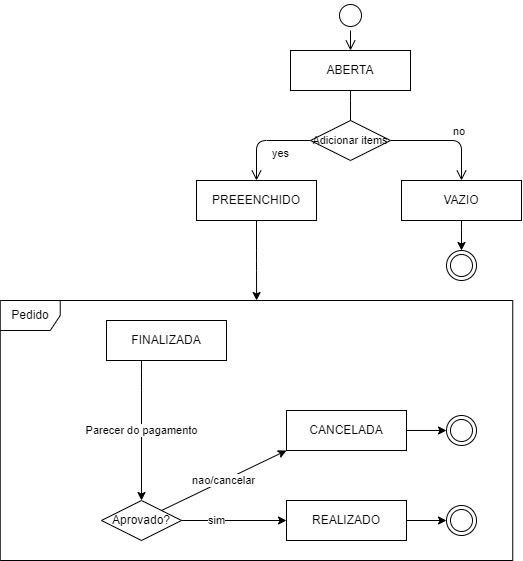

# Documentação do Software

Este documento apresenta os aterfatos de design do projeto, desenvolvidos para apoiar o desenvolvimento de software da sprint 3.

## Interface mockups

Os mockups ajuda a melhor entender as caracteristicas que a serem criadas.

### Mockup para Cdu1.01a

A seguinte figura apresenta o mockup para o use case "Novo Registo". O cliente acede ao sistema por um browser.

### Mockup for US1.1b 

Como utilizador tenho que fazer login para começar a comprar produtos.

A seguinte figura apresenta o mockup para o use case "Login". O cliente efectua login para efectuar compras. O cliente pode analizar o carrinho de compras antes de submeter a ordem de compra, remover produtos ou continuar o processo de compra de mais artigos.

### Mockup para US1.1c 

Como utilizador tenho que fazer login para que possa completar o meu processo de registo acedendo ao meu perfil e inserindo os dados necessários na minha conta.

A seguintes figuras demonstram o processo de inserção dos dados neccessários para que possa completar o processo de registo.

### Mockup for CdU1.11

Como administrador da plataforma, tenho como função fazer a gestão dos produtores e identificar o seu estado perante a mesma.

A seguinte figura demonstra o processo de validação dos produtores definindo o seu estado.

## Class model

Baseado no diagrama de dominio, foi desenvolvido o diagrama de clases.

Baseada no modelo de dominio, foi elaborado um diagrama da maquina de estados da classe de Encomenda. 
Foi escoilhida esta classe com base na importância para o projeto. 

Quando o cliente faz a abertura da encomenda pode inserir items á encomenda ou não realiza a encomenda.
Assim que inicia o pedido, aguarda-se o pagamento. Após recesseção do pagamento, o pedido de encomenda é realizado. Senão o pedido será cancelado. 

## Novo Registo (UC1.01) Sequence Diagram

O seguinte diagrama de sequência não apresenta todas as possíveis interações mas sim as básicas.

## Caso de uso: Valida Produtor(CdU1.11) Sequence Diagram

O seguinte diagrama de sequência apresenta as interações básicas do caso de uso Valida Produtor.

[Back Home](Home)
